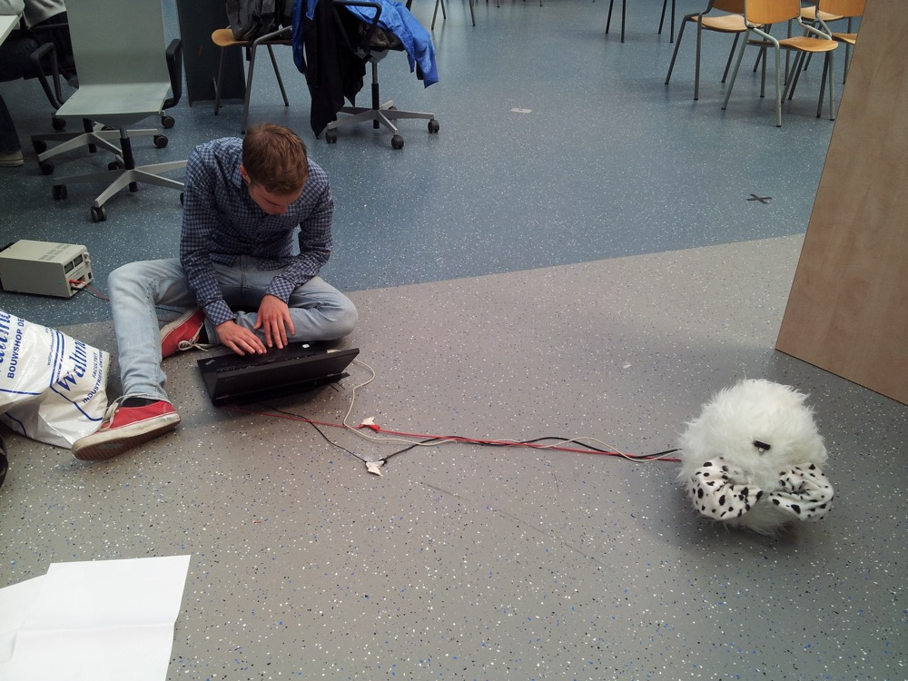

<Title>Furdinand</Title>
<SubTitle>TU Delft - 2016</SubTitle>

<HeroImage>

</HeroImage>

<IntroText>
Using an iterative building-first approach and together with a group of five others, I built and designed a needy robot. We built three prototypes and we improved the interaction on every iteration. I worked as one of the two engineers of the group, where I worked on building and programming the actual robots. I also worked a lot on perfecting the interaction. The project involved an Arduino, laser cutting, sewing, electronics, a lot of testing and cuteness.
</IntroText>

<RegularBlock>

## Ideation
The first question we asked ourselves was: What does it mean to be needy? Through a workshop and exercises we explored ways in which we could express neediness. We held a number of brainstorming sessions in which we came up with needy robot ideas. We ultimately landed on the idea of a robot grabbing you and staying attached to your leg — even when you are trying to get away.

## Prototype 1: Exploring Neediness
With this idea in mind, we all started crafting different little prototypes of needy robots. An important insight we gained here is that we wanted to stay away from a humanoid form and focus on expressing the neediness through expression and movement.

## Prototype 2: Arnold.
While building the second prototype — which we named Arnold — we focused on incorporating electronics and coming up with a story and different mechanisms around the interaction. We focused mainly on the two expressions we wanted to convey. The first one was the expression of being scared to be alone. This is when someone is in the vicinity, but not very close. At this point Arnold starts shaking. When somebody comes closer to Arnold he starts to relax and the shaking changes into a relaxed pulse.

## Prototype 3: Cracking the nut.
For our third prototype we build a robot that could express attention with its arms and hug someone’s leg when it was close. We also made it fluffy to make it more appealing for people to come up to and we introduced the concept of waving arms to lure people towards it.

<Gallery>

</Gallery>

## Prototype 4: Furdinand
What we noticed during the third prototype was that people sat down with the robot to interact with it. We used this for our final robot and made it bigger and able to move its arms in three dimensions so it could really hug someone. We also expanded the interaction to have five different phases, based on the distance to the robot and whether or not it had grabbed anything. We presented Furdinand at a fair and the reactions were even more positive than we expected. People asked if they could take Furdinand home.

</RegularBlock>