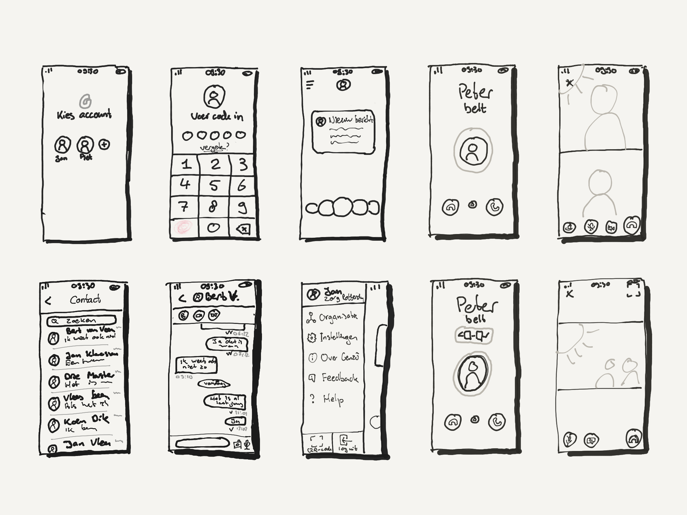
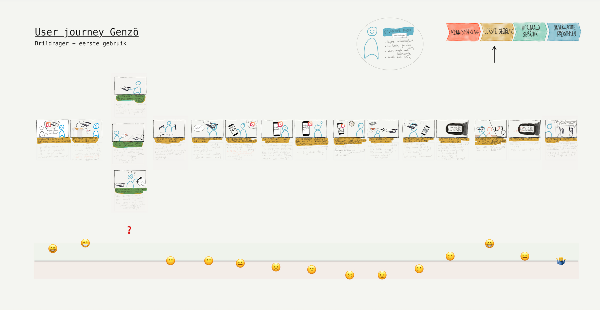

import ColumnBlock from "../components/ColumnBlock"
import CompareQuality from "../components/compareQuality"
import { Link } from "gatsby"

<Title>Genzõ</Title>
<SubTitle>1Minuut - Healthcare Innovation</SubTitle>

<HeroImage>

</HeroImage>

<Wide>
  <IntroTable>

  | Year      | Role                             |
  | --------- | -------------------------------- |
  | 2018 - Now | Product Designer & Product Owner |

  </IntroTable>
</Wide>

<IntroText>
Through many iterations, I worked on designing and optimizing Genzõ. I transformed Genzō into an easy-to-use and reliable app focused on enabling remote expertise for healthcare professionals.
</IntroText>

<RegularBlock>

# What is Genzõ?
Genzõ enables remote expertise using smart glasses. It focuses on healthcare professionals and connects two types of users:
1. A care worker or nurse that **needs help** while dealing with a specific situation that he or she doesn't have the expertise or qualifications to deal with.
2. A **specialist** with the **expertise** to deal with the situation, but who is **not at the location**.

Due to an aging population, care demands and complexity in elderly care are increasing rapidly. The time spent by specialists is becoming more and more valuable. Genzõ makes it possible for non-experts to call in an expert. They can grab a pair of smart glasses and use Genzõ to make a call. They can then stream their point of view to the smartphone or tablet of the specialist. The specialist assesses what needs to be done and instructs the care worker on what to do next. The care worker is hands-free and can immediately implement the advice.

## My role
I work as a Product Designer and Product Owner at 1Minuut on the Genzõ product (along with some other projects). Genzõ is available on Android, iOS, Vuzix, and Google smart glasses. There are also a few web projects connected with Genzõ. I have been working on Genzõ for two years and during this time I have worked on numerous improvements. Some of the challenges and results can be found below. I have divided them into three sections:
1. <Link to="#work">Make it work</Link>
2. <Link to="#easy">Make it easy</Link>
3. <Link to="#manage">Make it manageable</Link>

# Make it work
One of the first things we did was setting the design goal for Genzō. After two weeks of research, we defined the following goal: **Enable safe, reliable, and easy-to-use remote expertise for healthcare professionals**. The priority was getting Genzõ from its prototypical state to a well-functioning app. We focused on stability and improving consistency, feedback, error prevention, and clarity.

</RegularBlock>

<ColumnBlock
  title="Heuristic evaluation & redesign"
  text="Our first objective was to make a clear and consistent design for the iOS and Android app. A heurstic evaluation of the current design was done. We went to one of our clients and interviewed users and consultants to identify the main issues that users had run into. We focused on finding bugs and identifying redundant functionality. Based on this analysis a redesign was made with a focus on chatting and video calling."
>

</ColumnBlock>

<ColumnBlock
  title="Visual design"
  text="I worked on a visual detail-oriented redesign of the iOS and Android app. A style guide was made, which later turned into a design system for Genzõ. The visual design followed the goal of clarity and consistency. It matches the caring and positive attitude of our target group and follows recent design trends."
  reversed
>

</ColumnBlock>

<ColumnBlock
  title="A structured way of developing"
  text="Working with inexperienced remote developers from a very different culture provided a challenging experience. I set up procedures and workflows that allowed us to improve the quality and efficiency of development. Among those were improved hand-off, a DTAP street, and improved collaboration with clients while testing. All of this helped with efficiently developing new functionality."
>

</ColumnBlock>

<ColumnBlock
  title="Improved video quality"
  text="Not regular UX design, but still very important in terms of UX: We decided to spend some time focusing on quality improvements. We reduced bugs in the app, improved stability and performance, and massively improved the video quality!"
  reversed
>
<CompareQuality />
</ColumnBlock>

<RegularBlock id="easy">

# Make it easy
With Genzõ working well, the next goal was making it even easier to use. A special focus was on the UX for smart glasses. I worked with our consultants and used journey mapping to identify insights. With these insights, I created an improved design for our smart glasses app. This meant drastically simplifying the experience and also thinking out-of-the-box.

</RegularBlock>

<ColumnBlock
  title="On-screen instructions on smartglasses"
  text="The vast majority of people have never used smart glasses before, which means that for a new Genzō user there is always a steep learning curve. One method we discovered to help users navigate this new interface was with the use of on-screen guidance. We made clear and concise on-screen instructions to help users navigate our app."
>

</ColumnBlock>

<ColumnBlock
  title="Customer journey mapping"
  text="With our consultants, I identified the user journey for the existing product. We analyzed the different users: the specialists and the care professionals without the expertise. We also made sure to look at first-use and at recurring-use and identified the expected emotional response and pain points for our users."
  reversed
>

</ColumnBlock>

<ColumnBlock
  title="Connecting quick & easy"
  text="One of the major pain points we discovered, was connecting the smartglasses to the internet. After exploring various possibilities, I designed a user flow to make this process quick and easy, with the help a single QR-code and a Mifi router."
>

</ColumnBlock>
<ColumnBlock
  title="Call with one click"
  text="Another important pain point was that users got lost or stuck in other apps on Vuzix devices. By setting Genzō as a launcher app — effectively making the smartglasses a dedicated one-app device — we made it possible to start up the device and call the most recent contact with just a single click. Making this work involved incorporating system settings and other OS functionality inside the Genzõ app itself."
  reversed
>

</ColumnBlock>

<RegularBlock id="manage">

# Make it manageable
Genzõ works with "*organizations"*. Users can use Genzõ to call other users within their organization. The improved stability and usability of Genzõ caused a growth in usage, leading to organizations with more users. Therefore, it became more and more essential to manage these organizations well. This prompted us to focus on a third type of user: the administrator. We interviewed administrators and project managers to identify insights, helping us make Genzõ easy to manage.

## Rethinking the architecture
By interviewing admins, we gained a deeper understanding of their desires and how their organizations were structured. Based on these insights, we decided to rethink how we structured organizations within Genzõ. We set out to make the organization structure as useful and clear as possible for both admin and end-users. We achieved this by reducing possibilities for end-users, increasing administrator powers, and adding user locations and functions for searchability.

</RegularBlock>

<ColumnBlock
  title="Clear and structured web-tool for admins"
  text="WAfter interviewing several Genzõ admins we decided to build a web-based admin tool. Administrators can access this tool on their PC and we can quickly ship new versions to them. The design uses the new organizational structure of Genzõ. It provides a clear overview and makes it simple and efficient to manage organizations."
  reversed
>

</ColumnBlock>

<ColumnBlock
  title="Improved user onboarding"
  text="I worked on a complete overhaul of the onboarding of Genzõ. First we gathered user insights and subsequently defined goals based on these insights. In the end we were able to drastically reduce elements that users need to remember, we made sure that users can start using Genzõ directly after onboarding and we made all of this as safe as possible. For the design I worked with security experts and I also spent a lot of effort on creating a smooth transitioning experience for existing users."
>

</ColumnBlock>