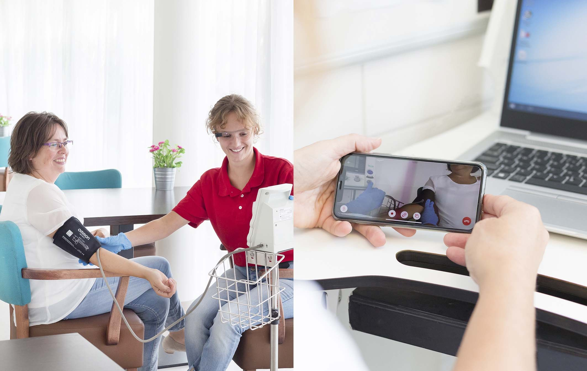
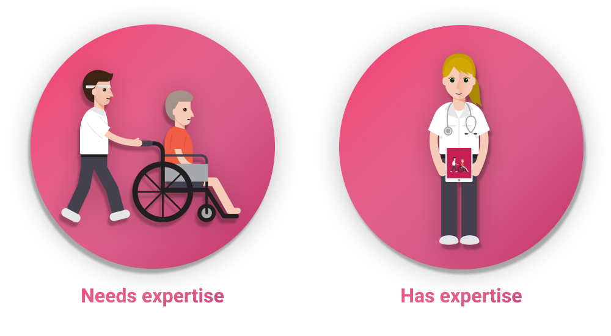
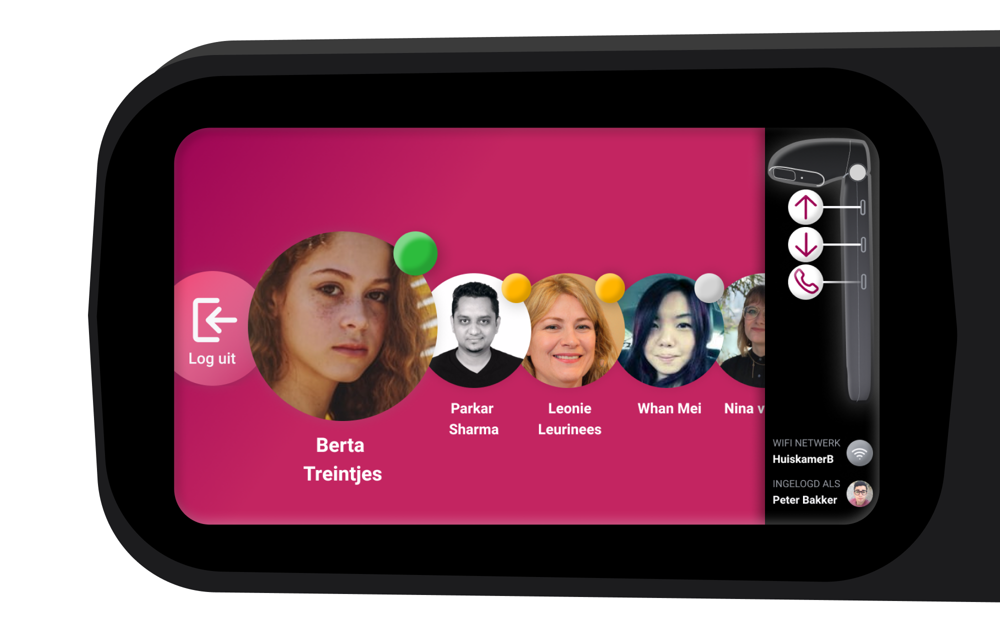
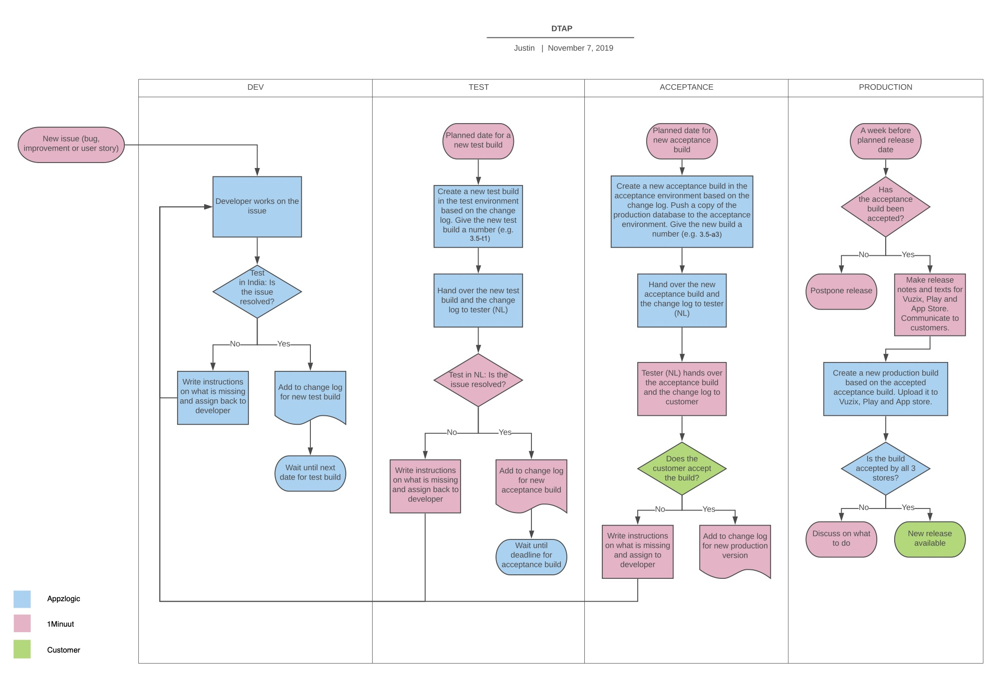
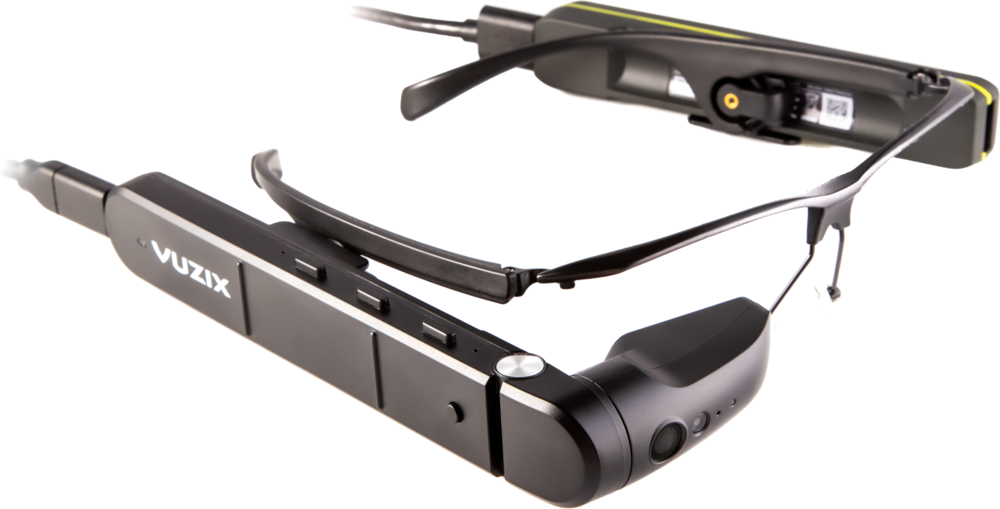
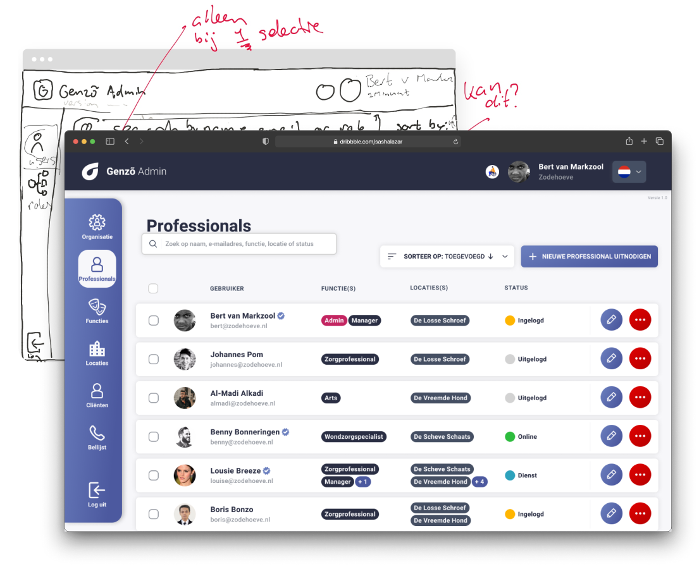
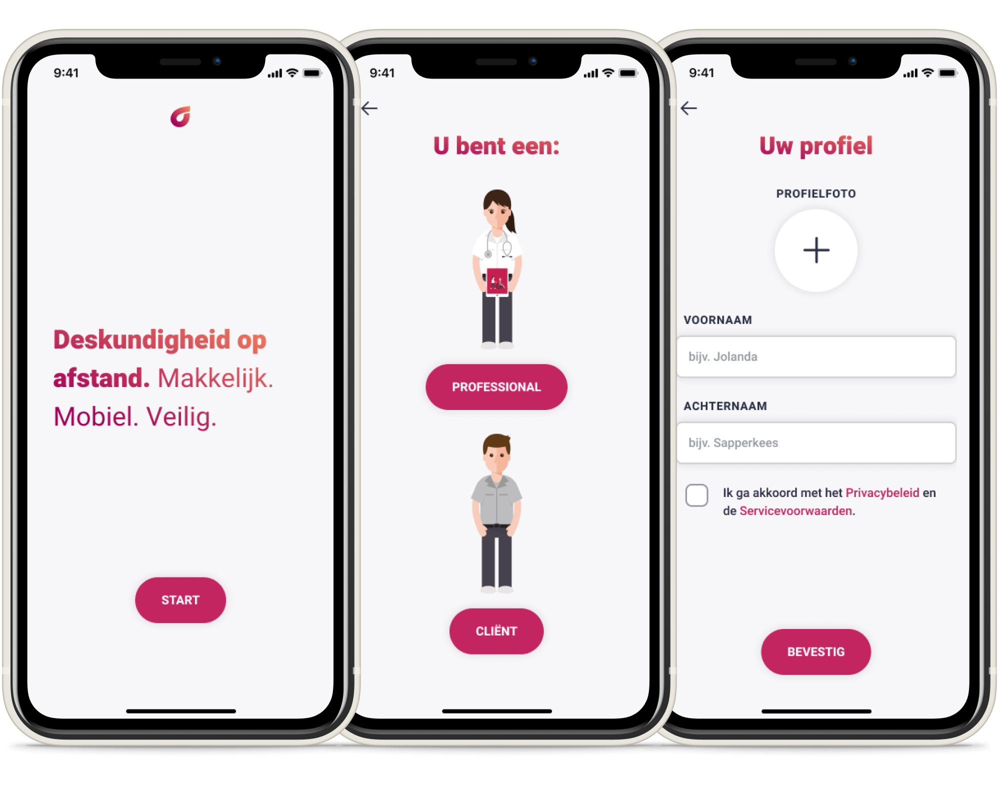

import ColumnBlock from "../components/ColumnBlock"
import CompareQuality from "../components/compareQuality"

<Title>Genzõ</Title>
<SubTitle>1Minuut - Healthcare Innovation</SubTitle>

<HeroImage>

</HeroImage>

<Wide>
  <IntroTable>

  | Year      | Role                             |
  | --------- | -------------------------------- |
  | 2018 - Now | Product Designer & Product Owner |

  </IntroTable>
</Wide>

<IntroText>
Through many iterations I worked on designing and optimizing Genzõ. During this time I helped to transform it into a easy-to-use and reliable app focused on providing healthcare professionals with remote expertise.
</IntroText>

<RegularBlock>

## What is Genzõ?
Genzõ can be best explained by describing its users and an example scenario. Typically there are two users: 
1. A care worker or nurse that **needs help** or information while dealing with a specific situation that he or she doesn't have the expertise or qualifications to deal with.
2. A nurse or specialist that does have the **expertise** to deal with this situation, but who is **not at the location**.

An example of a typical scenario: A nurse in a nursing home is helping a resident and finds a wound. The nurse isn't sure what to do. She grabs a pair of smartglasses and uses the Genzõ app to call a wound care specialist and to stream her point of view to the smartphone of the specialist. The specialist assesses what needs to be done and instructs the nurse on what to do next.

## My role
I work as a Product Designer and Product Owner at 1Minuut on the Genzõ product (along with some other projects). I have been working on Genzõ for two years and during this time I have worked on numerous improvements. One of the first things I did was setting the design goal for Genzõ. Based on a two-week research analysis, the following goal was defined:
> Make it easy for care professionals to safely enable remote expertise using smart glasses from and to any possible location.

You can find some of the challenges and results below:

</RegularBlock>
<ColumnBlock
  title="Visual redesign of the iOS and Android app"
  text="Our first objective was to make a fresh redesign of the iOS and Android app. We went to one of our clients and interviewed users and consultants to identify the main issues that users had run into. Based on insights gathered there we started a redesign for Genzõ. We focused on improving consistency, feedback, error prevention and clarity."
  reversed
>

</ColumnBlock>
<ColumnBlock
  title="On-screen instructions on smartglasses"
  text="The vast majority of people has never used smartglasses before, which means that for new Genzõ users there is always a steep learning curve. Through interviewing users and consultants at one of our clients, we identified the main issues that users were running into. With clear and concise on-screen instructions a design was made to help users learn how to control our app on smartglasses."
>

</ColumnBlock>
<ColumnBlock
  title="Improved video quality"
  text="Not a regular design iteration, but still very important in terms of UX: It focused on quality improvements. We focused on reducing bugs in the app and on improving stability, performance and video quality!"
  reversed
>
<CompareQuality />
</ColumnBlock>
<ColumnBlock
  title="Structured way of developing"
  text="Working with inexperienced remote developers from a very different culture provided a challenging experience. I set up procedures and workflows that allowed us to improve the quality and efficiency of development. Among those were improved hand-off, the introduction of a DTAP street and improved collaboration with some of our clients while testing. All of this helped to efficiently develop new functionality that also works well."
>

</ColumnBlock>
<ColumnBlock
  title="Easy internet connectivity"
  text="Through journey mapping and usability testing we found that one of the major pain points for users was connecting the smartglasses to the internet. After exploring various possibilities, I designed a user flow to make this process quick and easy, with the help of QR-codes and Mifi routers"
  reversed
>

</ColumnBlock>
<ColumnBlock
  title="Starting a call quickly"
  text="Another pain point was users getting lost and/or stuck in other apps on Vuzix devices. By setting Genzõ as a launcher app — effectively making the smartglasses a dedicated one-app device — we made it possible to start up the device and call the most recent contact with just a single click. Making this work involved incorporating system settings and other OS functionality inside the Genzõ app itself."
>

</ColumnBlock>
<ColumnBlock
  title="Clear and structured web-tool for admins"
  text="With the use of Genzõ growing, it became more and more important to manage these organisations well. By interviewed admins from a few of our clients, we found out about their desires and how their organisations were structured. We also spoke to project managers and got feedback from the end users of Genzõ. Based on this we identified insights, that were used to design and build a clear and structured web-tool requiring as little management as possible."
  reversed
>

</ColumnBlock>
<ColumnBlock
  title="Improved user onboarding"
  text="I worked on a complete overhaul of the onboarding of Genzõ. First we gathered user insights and subsequently defined goals based on these insights. In the end we were able to drastically reduce elements that users need to remember, we made sure that users can start using Genzõ directly after onboarding and we made all of this as safe as possible. For the design I worked with security experts and I also spent a lot of effort on creating a smooth transitioning experience for existing users."
>

</ColumnBlock>