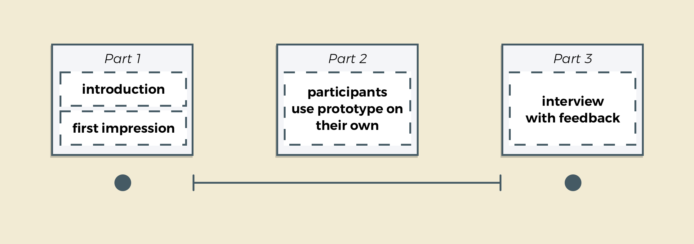
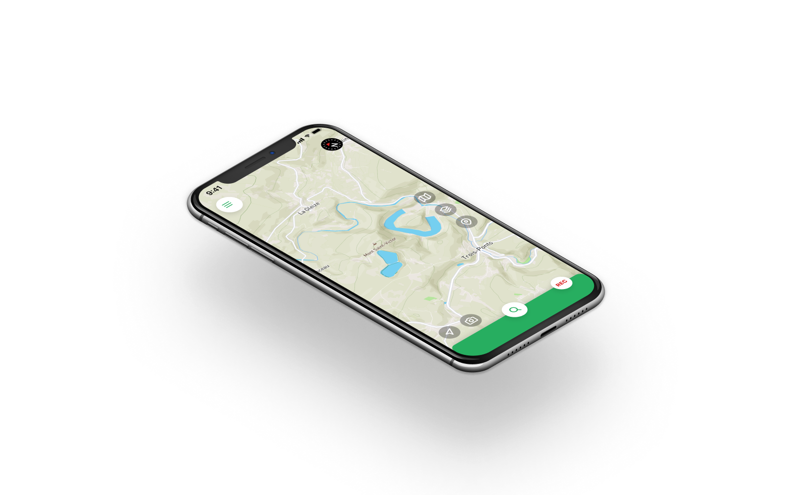
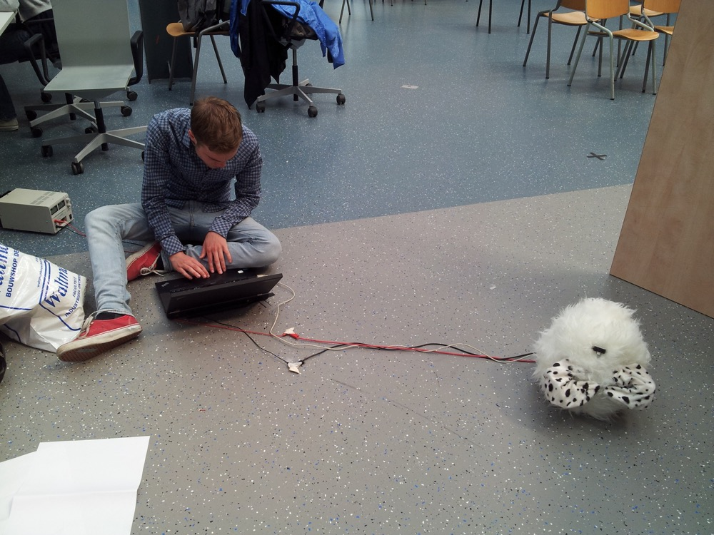

import ColumnBlock from "../components/ColumnBlock"

<Title>Genzō</Title>
<SubTitle>1Minuut - Healthcare Innovation</SubTitle>

<HeroImage>

</HeroImage>

<Wide>
  <IntroTable>

  | Year      | Role                             |
  | --------- | -------------------------------- |
  | 2018 - Now | Product Designer & Product Owner |

  </IntroTable>
</Wide>

<IntroText>
Through many iterations I worked on designing and optimizing Genzõ. During this time I helped to transform it into a easy-to-use and reliable app focused on providing healthcare professionals with remote expertise.
</IntroText>

<RegularBlock>

## What is Genzō?
Genzō can be best explained by describing its users and an example scenario. Typically there are two users: 
1. A care worker or nurse that **needs help** or information while dealing with a specific situation that he or she doesn't have the expertise or qualifications to deal with.
2. A nurse or specialist that does have the **expertise** to deal with this situation, but who is **not at the location**.

An example of a typical scenario: A nurse in a nursing home is helping a resident and finds a wound. The nurse isn't sure what to do. She grabs a pair of smartglasses and uses the Genzõ app to call a wound care specialist and to stream her point of view to the smartphone of the specialist. The specialist assesses what needs to be done and instructs the nurse on what to do next.

## My role
I work as a Product Designer and Product Owner at 1Minuut on the Genzõ product (along with some other projects). I have been working on Genzō for two years and during this time I have worked on numerous improvements. One of the first things I did was setting the design goal for Genzō. Based on a two-week research analysis, the following goal was defined:
> Make it easy for care professionals to safely enable remote expertise using smart glasses from and to any possible location.

You can find some of the challenges and results below:

</RegularBlock>
<ColumnBlock
  title="Visual redesign of the iOS and Android app"
  text="Our first objective was to make a fresh redesign of the iOS and Android app. We went to one of our clients and interviewed users and consultants to identify the main issues that users had run into. Based on insights gathered there we started a redesign for Genzō. We focused on improving consistency, feedback, error prevention and clarity."
>

</ColumnBlock>
<ColumnBlock
  title="Improved video quality"
  text="Not a regular design iteration, but still very important in terms of UX: It focused on quality improvements. We focused on reducing bugs in the app and on improving stability, performance and video quality! I worked with our developers and our QA tester on setting up a workflow that allowed us to create a much better app."
  reversed
>

</ColumnBlock>
<ColumnBlock
  title="Structured way of developing"
  text="At the end of this iteration we were able to solve some major issues. The video calling function now worked every time and the quality was greatly improved. We also now had a procedure in place to develop new functionality that also works well."
>

</ColumnBlock>
<ColumnBlock
  title="On-screen instructions on smartglasses"
  text="New device; hard to learn
  Journey mapping
  Easy for the user"
  reversed
>

</ColumnBlock>

<ColumnBlock>

## A DTAP street
- Allow acceptance for our clients

</ColumnBlock>

<ColumnBlock>

## Easy internet connectivity
LTE or eSim would be easiest
A QR-code makes it possible to connect to WiFi quickly
Various possibilities

</ColumnBlock>

<ColumnBlock>

## A quick start with a call
Setting Genzō as a launcher app prevents errors from happening

</ColumnBlock>

<ColumnBlock>

## Quick calls via voice commands 
- makes calling the right person quick and easy
- testing languages
- animated design

</ColumnBlock>

<RegularBlock>

</RegularBlock>
<ColumnBlock>

## A fully new, clear and structured web-tool for admins
- based on admin input
- web-bases
- reducing input

</ColumnBlock>