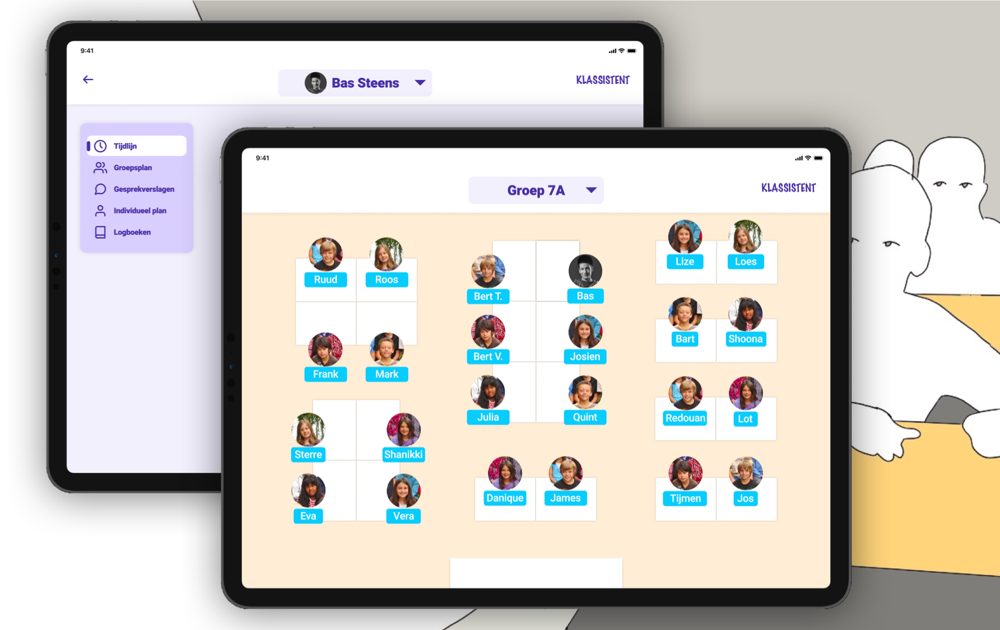

<Title>Klassistent</Title>
<SubTitle>Two day case</SubTitle>

<HeroImage>

</HeroImage>

<RegularBlock>

**Klassistent** is a tool to help teachers with the administrative pressure related to special care students.

This entire project was done in just two days and entirely as an individual project. In two days I went through the process of a *Discovery*, *Define*, *Ideate* and *Develop* phase. 

An English version is not (yet) available, but the Dutch version can be found by [clicking on this link](img/klassistent.pdf).
</RegularBlock>

