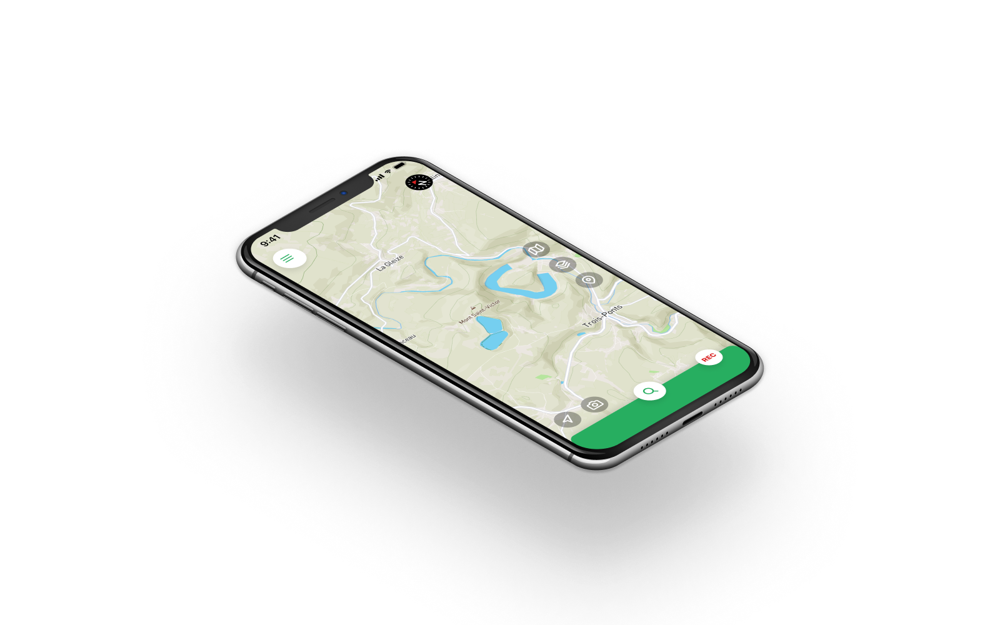

<Title>Locus</Title>
<SubTitle>TU Delft - 2015 & 2019</SubTitle>

<HeroImage>

</HeroImage>

<IntroText>
I was part of the team that made a redesign for this clunky to use navigation app; transforming it into an app that helps outdoor enthusiasts to plan, to finish and to relive their perfect route.
</IntroText>

<RegularBlock>

## The objective

Our goal was simple: redesign [Locus Map Pro](https://www.locusmap.eu) and make it better. 

## What is Locus Map Pro?

Locus Map Pro aims to help outdoor enthusiasts reach their destination. However, Locus Map offers much more than just navigation: it facilitates users in every aspect of outdoor activities. Among others, these functions include choosing and uploading maps, recording tracks, saving tracks and points, sharing routes and geocaching.

<Gallery>

</Gallery>

## Which issues do users experience?

Locus Map offers a big variety of functions. Our process started with a thorough analysis of the current design. After that an extensive user test was done. A study was conducted to learn about the experience that users have while using this application and where problem might occur.

The main conclusion of the study is: users of Locus Map cannot find functions intuitively. It takes first time users considerably more steps than necessary to perform a task. We identified five main difficulties that users face while using the app:

1. There is a lack of feedback
2. Some icons and buttons are unclear
3. The more button is overlooked
4. There are way too many options
5. Users try to navigate through search

## How to improve the usability?

One of the main problems concerns the hierarchy and structure of the application. Thus the first step of the redesigning process was to restructure the functions. We decided that when the application is opened, the user should be guided through all the steps to create a route — without forcing the user. This matches the users' expectations that were found during the first user study.

Instead of only looking at what happens when using the app and what goes wrong, I proposed that we should also look into **why** people use the app. The main reason people use this app and not for instance Google Maps, is that they want to hike, bike or sail a nice route (and not necessarily the fastest route). During our redesign this was something that we focused on and really helped our design.

> It is not about finding the fastest route. It is about finding the nicest route.

## How to structure the new design?

We identified that the outdoor experience and interaction with the app consists of three phases: preparation, journey and post journey. In the preparation phase the user creates a route. During the journey the user will have access to all the tools he/she would need on the road, like record track, current location, nearby points, camera, search and navigate. After the journey the user has the ability to evaluate and share the route and data.

In the preparation phase the user wants to set a route. To set a route four things are needed: the activity, a map that meets the users need of information, points the user wants to pass by and finally a route between all these points. Because these four steps are always necessary for creating a route the new interface will guide the user through these four steps. This makes it easier for beginning hikers to create a route and expert hikers will have a good overview. These steps should be guiding and not forcing. The user needs to have the possibility to go back and have an overview.

</RegularBlock>
<Gallery>

</Gallery>
<RegularBlock>

## What can be improved based on the first redesign?

We tested our redesign through paper prototypes with twelve participants. The participants were selected with the same criteria as during the user test of the original app. After this a number of changes were made in the design:

* The step sequence is again indicated but less highlighted through a less ‘forcing’ horizontally alignment.
* Steps do not necessarily need to be taken, as a default configuration is set depending on the current position and the last activity.
* The most important functions can now all be reached through just one step.
* Users can alter any step of their trip at any given moment before and during their journey.
  This leads to a more suggestive approach as opposed to the strictly guiding approach of the previous redesign.

</RegularBlock>
<Wide>
<Gallery>

</Gallery>
</Wide>
<RegularBlock>

## How can the design be upgraded for 2019?

Four years later I decided to do a simple redesign of the app. In this design I made sure to maintain the concept behind the previous designs: the four clear steps to plan a route and the easy access to important functions. I made a few changes to adapt to larger screens (e.g. searching at the bottom of the screen) and made the UI look a bit more clean and polished.

</RegularBlock>
<Wide>
<Gallery>

</Gallery>
</Wide>
<RegularBlock>

</RegularBlock>
