import IntroBlock from "../components/introBlock"
import IntroTable from "../components/introTable"

<Title>Taming Esorta</Title>
<SubTitle>Graduation Project - 2018-2019</SubTitle>

<HeroImage>

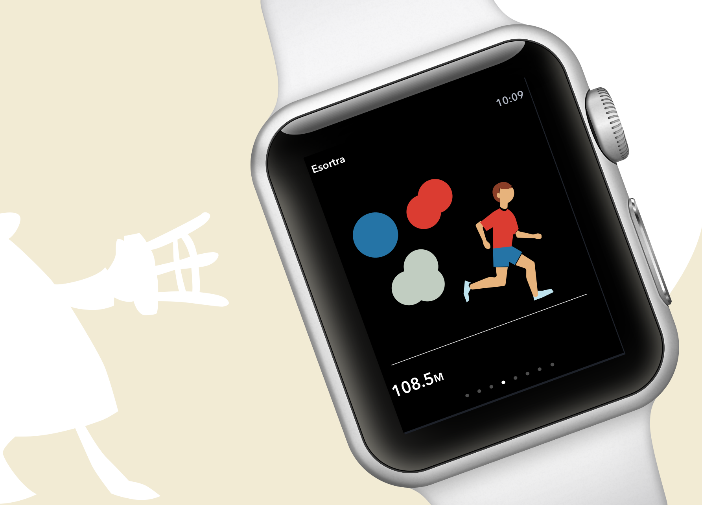
</HeroImage>

<Wide>
<IntroTable>

| Year | Clients | Role | 
| :---- | ---- | ---: |
| 2017-2018 | Delft University of Technology, Erasmus Medical Centre & 1Minuut | Individual project | 
</IntroTable>
</Wide>

<IntroText>
How do you motivate osteoarthritis patients to exercise when this is very painful for them? For my graduation project I worked on a way to solve this question. The result is Taming Esortra — a persuasive game that helps people with osteoarthritis to reduce and gain control over the burden of their disease.
</IntroText>

<RegularBlock>

## Objective
This project started at the Erasmus Medical Centre in Rotterdam. At the 18th floor of the hospital, the [Biomedical Imaging Group Rotterdam](http://www.bigr.nl/) was working on a data model to predict the development of osteoarthritis in patients.

They realized that this model alone wouldn't be enough to help people diagnosed with osteoarthritis. They were looking for a way it could be used to change behavior. That is were I came in.

I divided the projects into four phases: research, defining the design vision, design and evaluation.

## Research
I identified four research fields: 
1. living with osteoarthritis, 
2. modern healthcare
3. behavior change and motivation 
4. eHealth and gamification.

### Living with osteoarthritis
Osteoarthritis is a very common joint disease. It occurs when more cartilage between joints breaks down than the body can produce. With less cartilage it is harder for the joints to bend, turn or stretch easily which causes pain and stiffness.

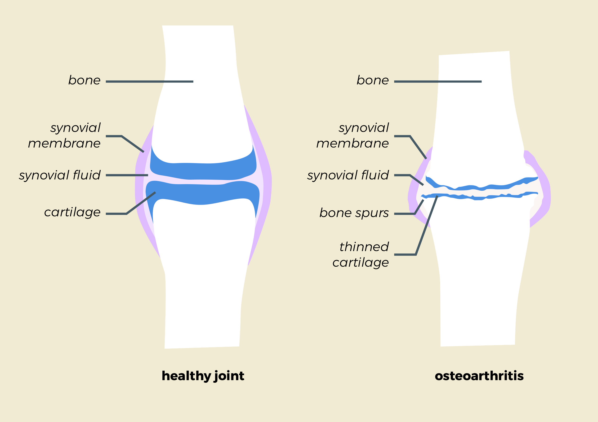

I held semi-structured interviews with a patient and experts in order to understand the impact osteoarthritis can have on the life of a patient. This helped me gain a lot of insights.

Research shows that many people with osteoarthritis benefit greatly by moderate exercise such as walking or swimming. Even when this is hard or painful for them to do.

Meanwhile many patients and even care professionals still believe the myth that osteoarthritis is caused by wear and tear of the joints. This causes patients to exercise less. 

I also found that effects like the unpredictability of OA and a decrease in mobility result in reduced social functioning and a reduced sense of well-being.

### Modern healthcare
After looking at the impact of osteoarthritis on the life of the patient, I focused on understanding the current healthcare system and the medical model. 

I found that the medical model has been very successful at curing diseases, but not at dealing with chronic disease. Mostly because there is not enough contact to help patients achieve behavioral change.

### Behavior change and motivation
I deep dived into behavior research and behavior change theory, to learn how to change behavior. 

In order to find out, I deep dived into behaviour research and behaviour change theory. I spent a lot of time researching the topic. With this being my thesis, I now had the opportunity to do so. I looked at anything from research on conditioning during the time of behaviorism, to theories of social cognitive theory and self-determination theory, theories about goal-directed and habitual processes, about heuristics and biases and about narrative and transportation. 

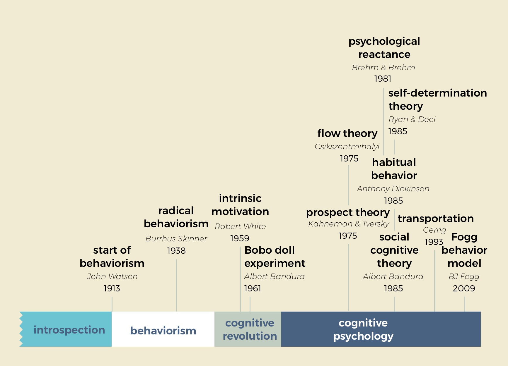

It would be too expansive to post all of the findings from this research, but I identified four mechanisms in particular that I used for my design:

1. *The self-reinforcing loop*. A self-reinforcing loop arises when a reward gets triggered by the result of its own (re)inforcement. This can snowball a change in behavior. 
2. *Means to an end*. Innate needs (competence, relatedness, autonomy) are more successful at changing behavior than external rewards (e.g money). People are more likely to achieve an external goal when this is used as a means for an innate need.
3. *The right challenge*. Someone is most likely to succeed at a goal, when the amount of skill required for it is in good balance. Meaning it is not too easy as to cause boredom, neither is it too hard as to cause anxiety or frustration. 
4. *The power of narrative.* Storytelling can help to motivate and support behaviour change by circumventing confirmation bias and other cognitive biases. Change in someone’s personal narrative can result in a change of attitude and behaviour.

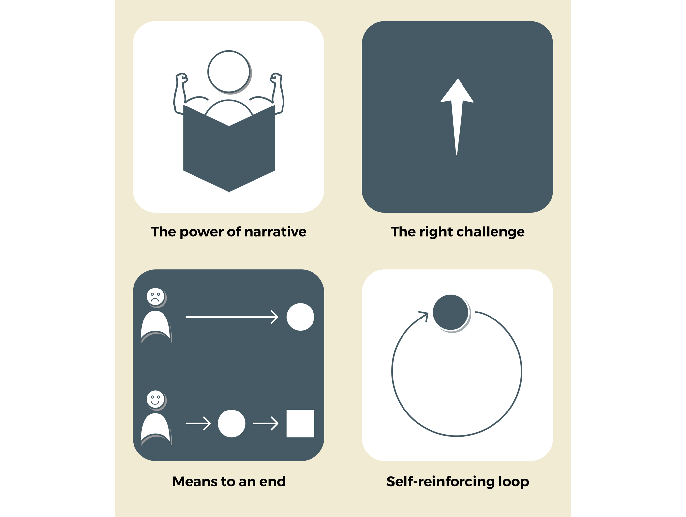

###  How can eHealth and persuasive game design help?
With a better understanding about osteoarthritis, the medical model and behavior change, I decided to find out what eHealth is and what its advantages and disadvantages are. eHealth is the use of ICT for healthcare. There are two types: stand-alone eHealth and blended care. Stand-alone eHealth is used as a way to substitute traditional care, whereas blended care combines eHealth and traditional care. I identified three advantages of eHealth:
1.  It can be given more frequently than traditional care (often even 24/7)
2.  It is mostly cheaper than traditional healthcare
3.  It allows for more control by the patient

A potential way of using combining behavior change and eHealth is in persuasive game design. This is game design that aims to create a user experienced game world, which changes the user’s behavior in the real world.

## Creating a design vision
After having identified valuable insights from the research phase and the four behaviour change mechanics, my next step was to establish the design vision and design goal.

The original assignment of this project was to make a design that motivates osteoarthritis patients to exercise. In three steps I went from this assignment to a design vision and a resulting design goal.

1. During the behavior change research I identified the *means to an end* mechanism. I decided that ‘more exercise’ should be a means, and not an end, because patients are not intrinsically motivated to exercise. The interviews showed that they are intrinsically motivated to reduce the burden of their disease; making this a goal for the patient.
2. The burden of osteoarthritis was found to be different for different people at different times. By quantifying and visualizing the personal factors that make up the most important parts of that burden, the burden can also act the other way around: as a means for the goal of ‘more exercise’. This means that connecting the two creates a *self-reinforcing loop*.
3. Now the only thing missing is way to convince the users to provide the information needed to quantify the personal burden and the amount of exercise. The two other identified mechanics can be used for this: *the power of narrative* and *the right challenge*. 

This results in the following design vision:

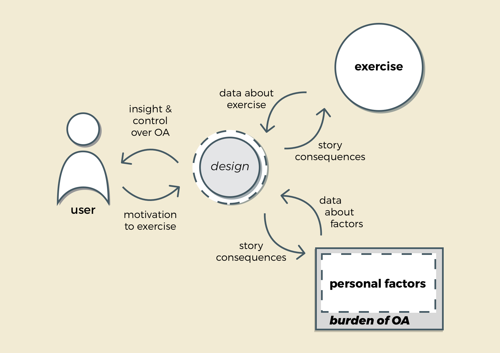

And from this vision the following design goal follows:
> The goal of the design is to help improve the control the patient has over osteoarthritis, by gaining insight in the burden of the disease and reducing that burden through exercise.

## Time to design
Using the design goal and vision I started a period of ideation. This involved a lot of brainstorming, discussions and simple sketches. In the brainstorming I always separated divergent phases, where I came up with ideas, from convergent phases, where I judged and clustered those ideas. Eventually I came up with three concepts that were not fully developed, but developed enough to make a decision about what way to go.

### Concept 1: Motivation treasure hunt
The idea behind this concept is to get motivated by starting. Every physical activity leads to a ‘motivation’ as a reward. This can be a self-recorded message, a funny cat video, encouragement by a friend or many other things. The focus of this concept is on structure, self-efficacy and variable rewards.

<Gallery>

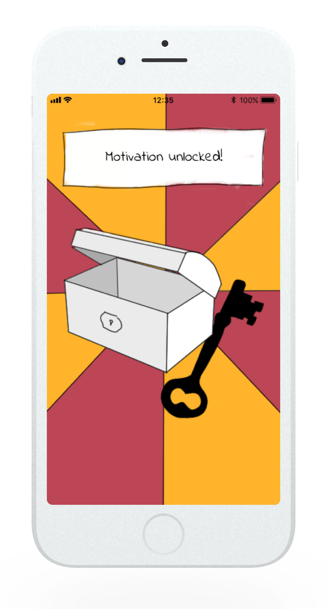

</Gallery>

### Concept 2: Chased
This concept is based on a metaphor, where you are a character in the game and you are being chased by the pain, stiffness, fatigue and other personal factors relating to your disease. By keeping track of these factors you can get an overview of everything that is bothering you and when this occurs. The focus of the concept is on treating the factors themselves (means to end), fun and on creating the right challenge.

<Gallery>

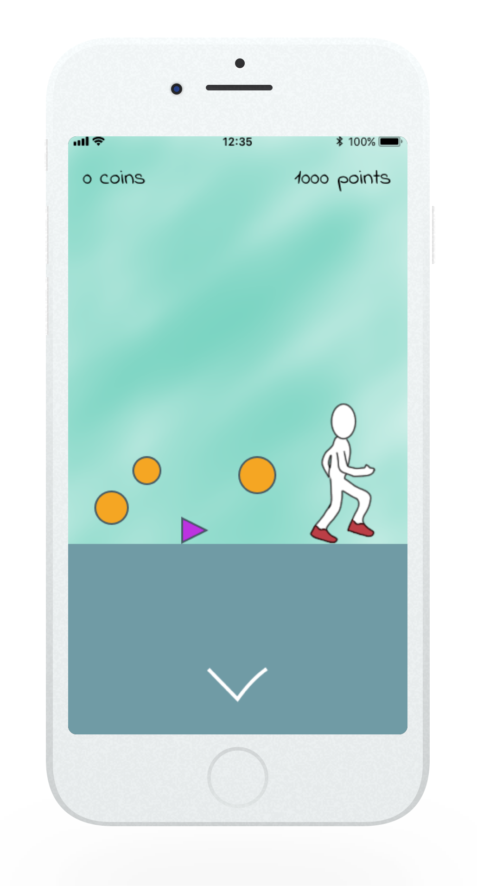

</Gallery>

### Concept 3: Bluff
This is a so-called shell game, based on the card game lying. In this concept at the end of every week at a predetermined time, there is a game with other players. Until that game starts, you have a week to unlock cards. You can unlock a card by completing a challenge. These challenges are linked to physical challenges. Unlocking cards can help you win the game at the end of the week. The focus of this concept is on the social part, creating a deadline, changing the focus (means to an end) and fun.

<Gallery>

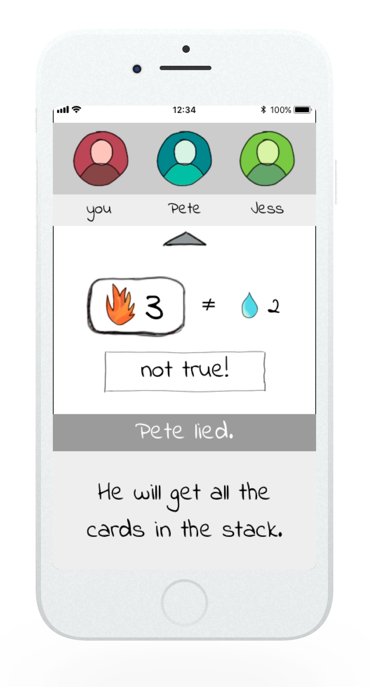

</Gallery>

### Choosing the concept
When choosing the concept I decided against using methods like a Harris Profile or Weighted Objectives, but to focus on potential by looking at the list of insights from the research and finding the best match with the design vision. 

I chose the second concept — chased — as the direction to move forward with. The reason for this choice was because this concept addressed most of the insights and focused more than others on the intrinsic motivation of the patients.

Having chosen a concept, I started to further develop it. This development was based on the existing design vision, on more in-depth research and on discussions with the partners in the project.

### Creating a narrative
The narrative of the game was further developed based on Joseph Campbell's idea of a common template for a broad category of stories based around a hero named the Hero's Journey. I chose the template of the Hero's Journey as a basis for the narrative in the game. 

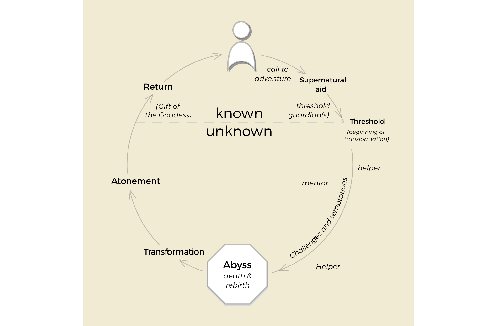

I made the idea of being chased by different personal factors into a narrative where  the overall burden of the disease is the starting point and different factors can be split of. I also decided to use an activity tracker in order to make it possible for the user to track their activity with minimum effort. By using the perspective of the user and building a user scenario, the narrative was further developed and the concept was expanded with more detail. The scenario can be found below.

</RegularBlock>

<Gallery>

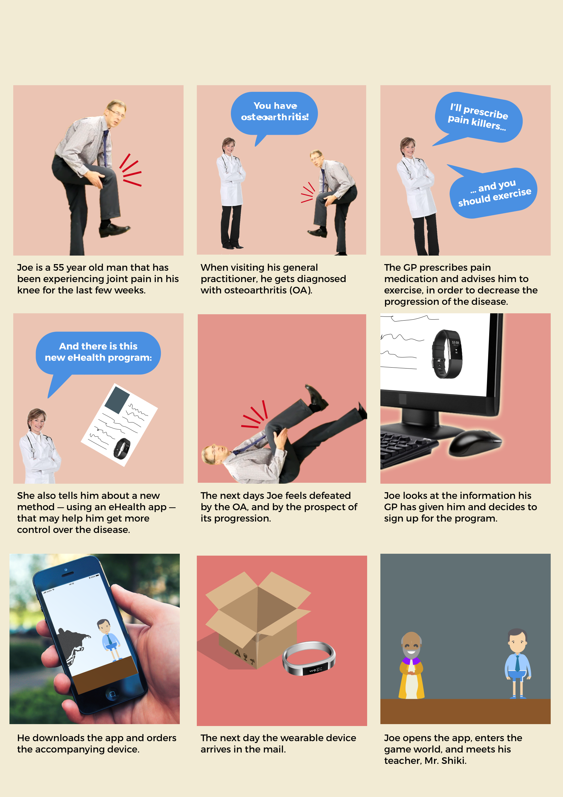
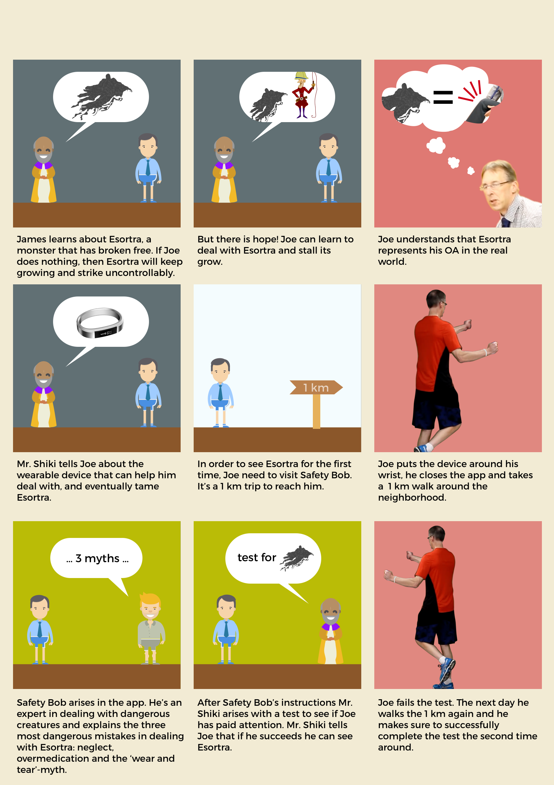
</Gallery>
<Gallery>

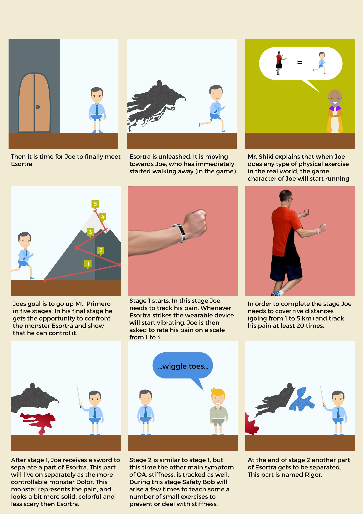
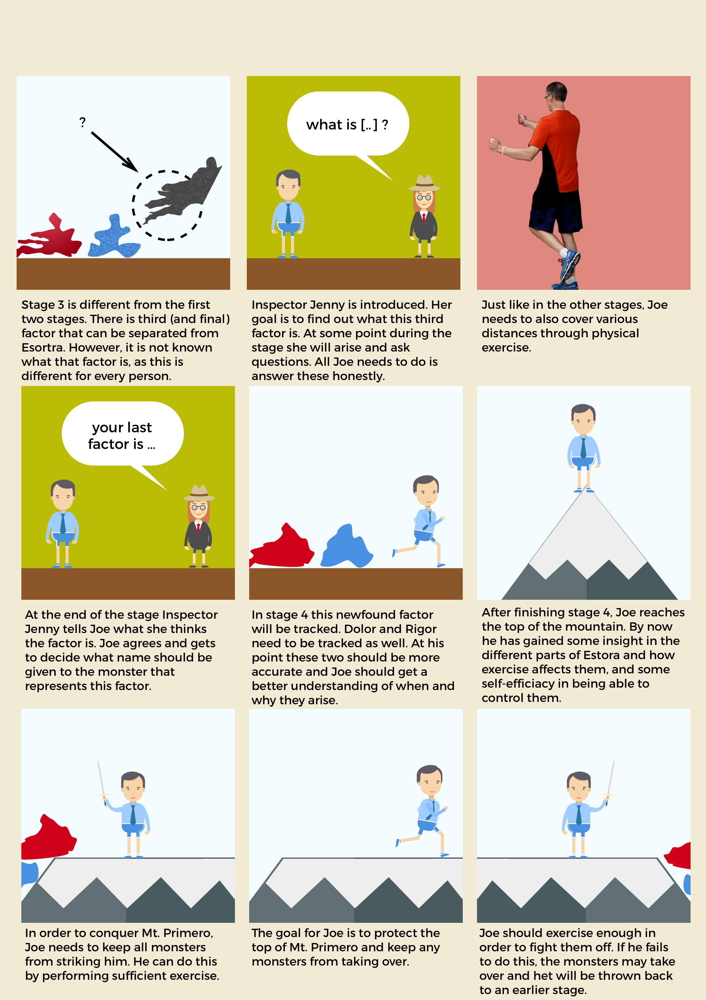
</Gallery>
<RegularBlock>

### Prototype
With the goal of a user test in mind, a prototype was created. I made it purposely look unfinished, but with working animations. As a first step, a flow of the design for the prototype was made into an extensive flowchart and as a Framer prototype.

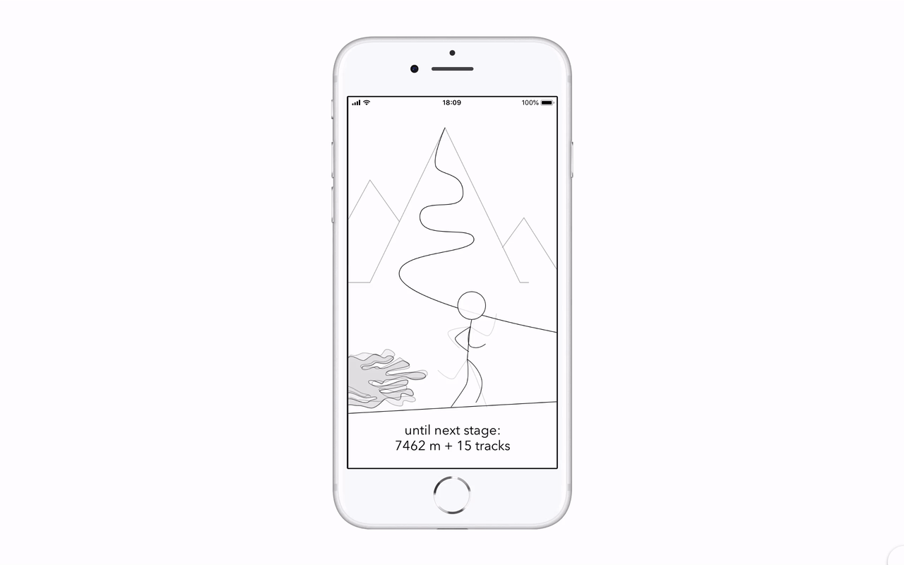

After that the prototype was programmed to work for an iPhone, with the help of a few developers. The initial goal was to use an activity tracker to track activity, but this proved to be too difficult to achieve on time. Therefor activity was measured through the iPhone in this first iteration, which made that only walking and running could be measured.

## Evaluating the prototype
My next step was to find out whether the goal of the design can be achieved in its current form, and in what way the effectiveness of the design can be improved. I conducted a user test in order to evaluate the effect of the design.

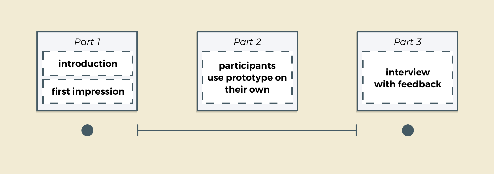

The user test consisted of three parts:

1. A first part where I visited the participants and observed their first experience with the app.  First I installed the prototype on their phone, while the participants were asked to fill in a questionnaire about the most troubling factor related to their disease. After this I introduced Taming Esortra. The participants were then asked to open the application and where given the task to follow the assignments in the app. I asked them to think out loud during this part of the test. Once they had walked for 50 meters, they were asked to fill in a questionnaire about the experience of using the prototype.
2. In the second part the participants used the app for 15 days on their own. On the 5th and 10th day they were asked to fill in a questionnaire about the main factors of osteoarthritis, — pain and stiffness in the joint(s) — and what other factors, activities and circumstances the participants would like to measure in order to gain additional insight and control
3. On the last day the participants were again asked to fill in the questionnaires from the first day and I interviewed them about their experience with using the app. In this interview laddering questions were asked in order to find reasoning behind the participant’s answers.

Important quotes, observations and findings about the application were transcribed on statement cards with reference to their source and clustered by problem origin. The data from the questionnaires was evaluated to find connections between use of the application and changes in control the participants feels over osteoarthritis. Important findings were identified from observations, interview and questionnaires that affect the usability and effectiveness of the design.

The study resulted in eighteen important findings about the usability and effectiveness of the prototype in achieving the design goal. I clustered these findings in five categories. These findings were used to create a sample redesign and a number of recommendations on how to move forward with all the knowledge gained from this project.

## Future recommendations
1. Make a smartwatch app the core of the design.
2. Add an overview of factors and physical activity.
3. Add a prediction of factors that can be shown to others.
4. Craft a richer story.
5. Add an initiation phase to the concept.
6. Look into other chronic diseases.
7. Continue as an iterative process with no fixed end.
8. Start investigating and building the AI.
9. Find a generic way to measure physical activity.
10. Test when to measure and what to measure.

</RegularBlock>
